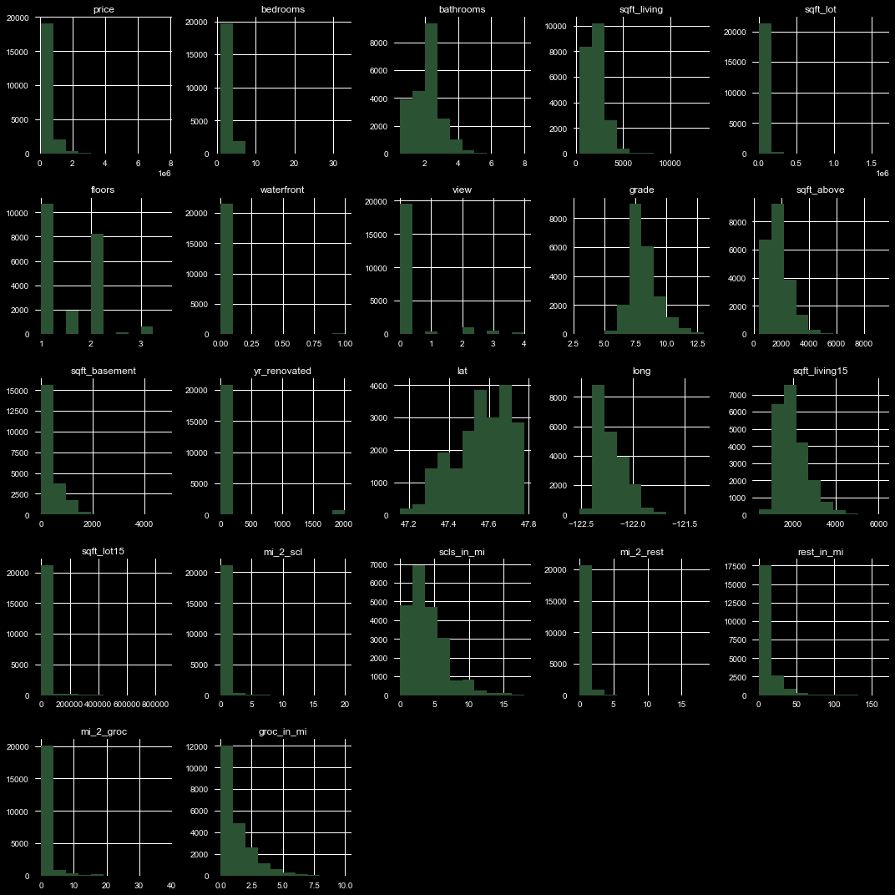
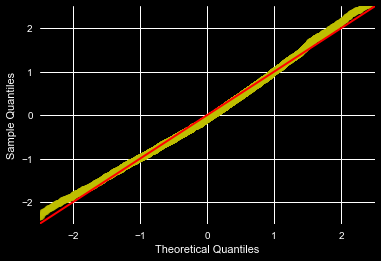
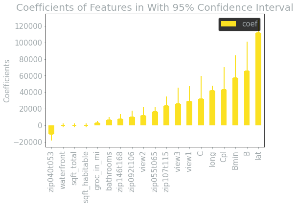
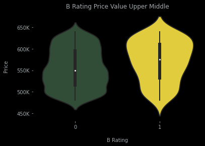
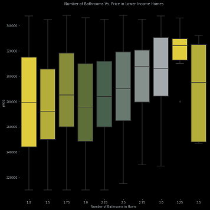
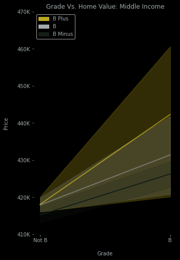

# King County Housing Regression Project 
 -Course: Flatiron Data Science  
 -Pace: Part time  
 -Instructor: Amber Yandow  
 -Authors: [Fennec C. Nightingale,](mailto:fenneccharles@gmail.com)[Thomas Cornett](mailto:thmscrntt33@gmail.com) & [Cody Freese](mailto:c_freese@ymail.com)

# Overview: 
Predict & map housing prices for income brackets in <a href="
https://goo.gl/maps/R72PRoBHnZcK7KCb8">King County</a> & make recommendations to help buyers & sellers get the most value for their money. 

# The Data:
CSV & Webscraped Data on homes, grocery stores, schools, and restaurants in King County, provided by Flatiron School & gathered via the ArcGis library.   
Our housing data includes: Sale Prices, Housing Sizes, Housing Conditions, Neighbors Housing Size, Yard Size, Bedrooms, Bathrooms, Floors, View & Location   
Our school data includes: School Names, Grades, Size, Websites, Whether Public or Private & Location    
& Grocery/Restaurant includes: Type, Seating Capacity, Grade, Phone Number, and Location.  

# The Process:
We used Python in Jupyter Notebook to perform <a href="https://machinelearningmastery.com/how-to-work-through-a-problem-like-a-data-scientist/"> OSEMN </a> & <a href="https://en.wikipedia.org/wiki/Ordinary_least_squares"> OLS </a> regression to create our model and predictions for housing prices in King County. 

# O - Obtain 
We obtained our King County Housing data here from Flatiron School/Kaggle. If you want to get started on your own, <a href="https://github.com/learn-co-curriculum/dsc-phase-2-project"> fork this repo.</a> 
Our School, Grocery & Food datasets come from <a href="https://developers.arcgis.com/"> ArcGis</a>, Check out our mapping notebook to see how we use it!  
Once we obtained our non-home datasets we created a function to calculate the distance between them and our homes, and added 6 columns to our main dataframe. If you want to see how we did it, check out our main notebook! Here is also where we create our dummy variables,   

# S- Scrub 
After importing all of our data we checked it for null values, outliers, duplicates, and any other errors there might be in our dataset. We checked each column and decided what data we needed to keep or discard, what we might need to fill, or any other alterations we could make to fix up our data before we start modeling. 

# E - Explore 
 
We check out our data to see how our values are distributed, if there is any strong correlation, or if theres anything we missed in our scrubbing. Some of the catagories we wanted to include had really high correlations, but our cut off was .75 so in order to remedy that we multiplied them by eachother, others with high correlation had to be dropped.

# M - Model 
We use the<a href="https://www.statsmodels.org/stable/regression.html"> Statsmodel regression models</a> to get our OLS best fit in this project.  To work with some of our data in this model, we also have<a href="https://stattrek.com/multiple-regression/dummy-variables.aspx"> to get dummies for</a> our catagorical variables. After doing an initial model including all of our variables we used a P-value cut off of .05 to go back through and refine our model, trying to make our predictions stronger.  After modeling, we used qq plots to check the distribution of our data and make sure our lines fit well. 
 

 # N - iNterpret 
 Here we plot and take a look at our coefficients for each of our models, to see what is affecting our price and what conclusions we can draw from it. 
 

 # Observations
- Different incomes have different priorities when it comes to buying or selling a home. In short, Low income tends to put more priority on pragmatic space, While Middle Income homes tend to put more on location and grade, a trend that will increase with importance as you go up income brackets. We made serveral reccomendations to both buyers and sellers based on our data. 
Here are a few of our favorite reccomendations: 
- If you're looking to buy a home in the upper medium range ($480,000 through $640,000) Your best deal is to look at homes that were built recently and are a bit bland, homes in the <a href="https://www.kingcounty.gov/Assessor/Reports/ArchivedAreaReports/~/media/Assessor/AreaReports/AreaReportGlossary.ashx"> C\6 </a>range are considerably cheaper, and could allow you to focus on other features you find important. 
 
- if You're looking to sell your home in the lower income range ($210,000 through $348,000) add bathrooms! so long as you don't exceed a 1:1 ratio for bedrooms and bathrooms, each bathroom will add value to your home
 
- if you're looking to sell your home in the medium income range ($348,00 through 480$) Get your grades up! Simply adding trim or a nice garden can add substantial value to your home, the higher the grade the more valuable it’s likely to be!
 

 
